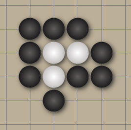

# Go #

This is an attempt to create one of my favorite games, an ancient board game called `Go`.

The goal is for each player to place `stones` on the board and capture more territory than the other player.

* One player uses white stones and the other player uses black.
* Once played, a stone cannot be moved.
* Stones can be `captured`, however, if a group of them is surrounded by opposing stones on all orthogonally-adjacent points, as in the image below.

  

* In this example, the `black` stones have gained three points of territory and have captured three `white` stones.
* When a game is over, the territory is counted along with captured stones to determine a winner.
* There are more rules, but none of them are important here.  

## `Just the Basics` ##

I have built a rough version of `Go`. It can be played with each click on the board laying an alternating stone. The game can be played as is, but I would really like to add some logic.  

## `The Future` ##

Hopefully I can eventually add some game logic to this project so that it is a fully playable game. In addition, wiring it up to be playable over the internet would also be a fantastic goal to add while I'm at it!
