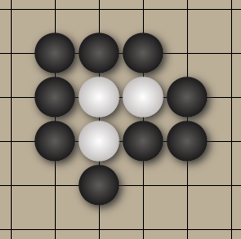

# Go (圍棋)

A fully playable version of the ancient board game **Go**, built with vanilla HTML, CSS, and JavaScript. Play a friend on the same screen or take on the built-in computer opponent — on desktop or mobile, online or offline.

**▶ Play it: https://brett-buskirk.github.io/go/**

## About the game

Go is a territory game for two players, Black and White, on a 13×13 grid. Players take turns placing stones on the intersections; once placed, a stone never moves, but it can be captured.

* A group of connected stones is captured and removed when the opponent fills its last **liberty** (empty adjacent point).
* When neither player wants to play on, both **pass** and the territory is counted to decide the winner.



*In this example the Black stones surround three White stones, capturing them and gaining the territory.*

## Features

* **Complete rules engine** — captures, liberties, the suicide rule, and the ko (repetition) rule, plus pass, resign, and game-over detection.
* **Territory scoring** — when both players pass, the game enters scoring mode: territory is detected automatically, you click any dead stones to remove them, and a live score is shown using area scoring with komi.
* **Play against the computer** — choose your color and a difficulty:
  * **Easy** — a fast heuristic bot that captures, defends its groups, and keeps its eyes.
  * **Hard** — a Monte Carlo Tree Search (MCTS) opponent that plays out thousands of games to pick its move.
* **Two-player mode** — pass and play on a single device.
* **Built-in rules guide** — a Rules button explains everything for newcomers.
* **Modern, responsive design** — a clean board that scales from desktop down to phones.
* **Installable PWA** — add it to your home screen and play offline.

## How to play

1. Open the game and pick **Two players** or **vs Computer** (and your color/level).
2. Click an empty intersection to place a stone. Black moves first.
3. Surround enemy groups to capture them; avoid suicide and illegal ko moves.
4. When the game winds down, click **Pass** twice to score. Mark any dead stones, read the final score, and start a **New Game**.

## Running locally

No build step or dependencies — it's plain static files. Either open `index.html` directly, or serve the folder over HTTP (recommended, so the service worker and offline support work):

```sh
python3 -m http.server
# then visit http://localhost:8000
```

## Tech

Vanilla HTML / CSS / JavaScript with jQuery, a generated SVG board, and a service worker for offline play. Hosted on GitHub Pages.
